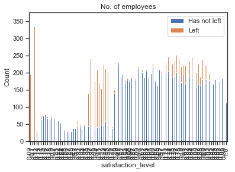

# Mini-project summary: 
### Building a predictive model using HR data, to predict employee churn.

Dataset can be found on [Kaggle](https://www.kaggle.com/giripujar/hr-analytics).


```python
import pandas as pd
import numpy as np
import sklearn
from matplotlib import pyplot as plt

from sklearn import preprocessing

import seaborn as sns
sns.set(style = 'ticks')

import warnings
warnings.filterwarnings('ignore')
```

## PART 1: Explore dataframe


```python
"""
# PART 1 : EXPLORE DATAFRAME

# STEPS MADE BELOW:::
    > [] Looked at data using excel first, to get a good overview of the data
    > [] Imported csv file as a pandas dataframe (employee_data)
    > [] Looked at employee_data.info() ::: 14,999 rows, no null values, list of column names
    > [] Looked at employee_data.describe() ::: shows mean, 
    > [] There doesn't seem to be any outliers.
    > [] Group data by 'left', to see any trends.
    > [] Group data by 'number_projects', to see any possible trends.
    > [] Also looked at a bunch of other things (not shown below)
            e.g... no. of people in each department
    
# A few patterns that I spotted from these steps:
    > [] Employees who have left the company tend to have lower satisfaction rates.
    > [] Employees were less likely to leave if they had a promotion in the last 5 years.
    > [] Employees who worked on 2,6 or 7 projects had very low satisfaction levels.
    
    
# A few changes I made to the dataset:
    > [] Renamed 'sales' column to 'department' (column name mistake)
    > [] Renamed 'Work_accident' column to 'work_accident' (to all lower case letters)
    > [] Renamed 'average_montly_hours' to 'average_monthly_hours' (typo in 'montly')
    
"""
pass
```


```python
employee_data = pd.read_csv("C:\Users\Prabesh K\Desktop\Projects\QuantSpark\HR_comma_sep.csv")
```


```python
employee_data.info()
```

    <class 'pandas.core.frame.DataFrame'>
    RangeIndex: 14999 entries, 0 to 14998
    Data columns (total 10 columns):
    satisfaction_level       14999 non-null float64
    last_evaluation          14999 non-null float64
    number_project           14999 non-null int64
    average_montly_hours     14999 non-null int64
    time_spend_company       14999 non-null int64
    Work_accident            14999 non-null int64
    left                     14999 non-null int64
    promotion_last_5years    14999 non-null int64
    sales                    14999 non-null object
    salary                   14999 non-null object
    dtypes: float64(2), int64(6), object(2)
    memory usage: 1.1+ MB
    


```python
employee_data.describe()
```


<div>
<style scoped>
    .dataframe tbody tr th:only-of-type {
        vertical-align: middle;
    }

    .dataframe tbody tr th {
        vertical-align: top;
    }

    .dataframe thead th {
        text-align: right;
    }
</style>
<table border="1" class="dataframe">
  <thead>
    <tr style="text-align: right;">
      <th></th>
      <th>satisfaction_level</th>
      <th>last_evaluation</th>
      <th>number_project</th>
      <th>average_montly_hours</th>
      <th>time_spend_company</th>
      <th>Work_accident</th>
      <th>left</th>
      <th>promotion_last_5years</th>
    </tr>
  </thead>
  <tbody>
    <tr>
      <th>count</th>
      <td>14999.000000</td>
      <td>14999.000000</td>
      <td>14999.000000</td>
      <td>14999.000000</td>
      <td>14999.000000</td>
      <td>14999.000000</td>
      <td>14999.000000</td>
      <td>14999.000000</td>
    </tr>
    <tr>
      <th>mean</th>
      <td>0.612834</td>
      <td>0.716102</td>
      <td>3.803054</td>
      <td>201.050337</td>
      <td>3.498233</td>
      <td>0.144610</td>
      <td>0.238083</td>
      <td>0.021268</td>
    </tr>
    <tr>
      <th>std</th>
      <td>0.248631</td>
      <td>0.171169</td>
      <td>1.232592</td>
      <td>49.943099</td>
      <td>1.460136</td>
      <td>0.351719</td>
      <td>0.425924</td>
      <td>0.144281</td>
    </tr>
    <tr>
      <th>min</th>
      <td>0.090000</td>
      <td>0.360000</td>
      <td>2.000000</td>
      <td>96.000000</td>
      <td>2.000000</td>
      <td>0.000000</td>
      <td>0.000000</td>
      <td>0.000000</td>
    </tr>
    <tr>
      <th>25%</th>
      <td>0.440000</td>
      <td>0.560000</td>
      <td>3.000000</td>
      <td>156.000000</td>
      <td>3.000000</td>
      <td>0.000000</td>
      <td>0.000000</td>
      <td>0.000000</td>
    </tr>
    <tr>
      <th>50%</th>
      <td>0.640000</td>
      <td>0.720000</td>
      <td>4.000000</td>
      <td>200.000000</td>
      <td>3.000000</td>
      <td>0.000000</td>
      <td>0.000000</td>
      <td>0.000000</td>
    </tr>
    <tr>
      <th>75%</th>
      <td>0.820000</td>
      <td>0.870000</td>
      <td>5.000000</td>
      <td>245.000000</td>
      <td>4.000000</td>
      <td>0.000000</td>
      <td>0.000000</td>
      <td>0.000000</td>
    </tr>
    <tr>
      <th>max</th>
      <td>1.000000</td>
      <td>1.000000</td>
      <td>7.000000</td>
      <td>310.000000</td>
      <td>10.000000</td>
      <td>1.000000</td>
      <td>1.000000</td>
      <td>1.000000</td>
    </tr>
  </tbody>
</table>
</div>


```python
# group data by 'left' column, and see if you spot any trends.
print(employee_data['left'].value_counts())
employee_data.groupby('left').mean()
```

    0    11428
    1     3571
    Name: left, dtype: int64
    


<div>
<style scoped>
    .dataframe tbody tr th:only-of-type {
        vertical-align: middle;
    }

    .dataframe tbody tr th {
        vertical-align: top;
    }

    .dataframe thead th {
        text-align: right;
    }
</style>
<table border="1" class="dataframe">
  <thead>
    <tr style="text-align: right;">
      <th></th>
      <th>satisfaction_level</th>
      <th>last_evaluation</th>
      <th>number_project</th>
      <th>average_montly_hours</th>
      <th>time_spend_company</th>
      <th>Work_accident</th>
      <th>promotion_last_5years</th>
    </tr>
    <tr>
      <th>left</th>
      <th></th>
      <th></th>
      <th></th>
      <th></th>
      <th></th>
      <th></th>
      <th></th>
    </tr>
  </thead>
  <tbody>
    <tr>
      <th>0</th>
      <td>0.666810</td>
      <td>0.715473</td>
      <td>3.786664</td>
      <td>199.060203</td>
      <td>3.380032</td>
      <td>0.175009</td>
      <td>0.026251</td>
    </tr>
    <tr>
      <th>1</th>
      <td>0.440098</td>
      <td>0.718113</td>
      <td>3.855503</td>
      <td>207.419210</td>
      <td>3.876505</td>
      <td>0.047326</td>
      <td>0.005321</td>
    </tr>
  </tbody>
</table>
</div>


```python
print(employee_data['number_project'].value_counts())
employee_data.groupby('number_project').mean()
```

    4    4365
    3    4055
    5    2761
    2    2388
    6    1174
    7     256
    Name: number_project, dtype: int64
    


<div>
<style scoped>
    .dataframe tbody tr th:only-of-type {
        vertical-align: middle;
    }

    .dataframe tbody tr th {
        vertical-align: top;
    }

    .dataframe thead th {
        text-align: right;
    }
</style>
<table border="1" class="dataframe">
  <thead>
    <tr style="text-align: right;">
      <th></th>
      <th>satisfaction_level</th>
      <th>last_evaluation</th>
      <th>average_montly_hours</th>
      <th>time_spend_company</th>
      <th>Work_accident</th>
      <th>left</th>
      <th>promotion_last_5years</th>
    </tr>
    <tr>
      <th>number_project</th>
      <th></th>
      <th></th>
      <th></th>
      <th></th>
      <th></th>
      <th></th>
      <th></th>
    </tr>
  </thead>
  <tbody>
    <tr>
      <th>2</th>
      <td>0.478769</td>
      <td>0.568505</td>
      <td>160.342546</td>
      <td>3.180486</td>
      <td>0.092965</td>
      <td>0.656198</td>
      <td>0.015494</td>
    </tr>
    <tr>
      <th>3</th>
      <td>0.687670</td>
      <td>0.716572</td>
      <td>197.507522</td>
      <td>3.286560</td>
      <td>0.175092</td>
      <td>0.017756</td>
      <td>0.023428</td>
    </tr>
    <tr>
      <th>4</th>
      <td>0.695132</td>
      <td>0.740009</td>
      <td>205.122108</td>
      <td>3.454983</td>
      <td>0.156472</td>
      <td>0.093700</td>
      <td>0.026804</td>
    </tr>
    <tr>
      <th>5</th>
      <td>0.678888</td>
      <td>0.762010</td>
      <td>212.061572</td>
      <td>3.800072</td>
      <td>0.150670</td>
      <td>0.221659</td>
      <td>0.018109</td>
    </tr>
    <tr>
      <th>6</th>
      <td>0.273458</td>
      <td>0.786550</td>
      <td>238.694208</td>
      <td>4.192504</td>
      <td>0.114140</td>
      <td>0.557922</td>
      <td>0.017036</td>
    </tr>
    <tr>
      <th>7</th>
      <td>0.118711</td>
      <td>0.859609</td>
      <td>276.078125</td>
      <td>4.113281</td>
      <td>0.015625</td>
      <td>1.000000</td>
      <td>0.000000</td>
    </tr>
  </tbody>
</table>
</div>


```python
employee_data = employee_data.rename(columns = {'sales':'department'})
employee_data = employee_data.rename(columns = {'Work_accident':'work_accident'}) 
employee_data = employee_data.rename(columns = {'average_montly_hours':'average_monthly_hours'})
```

## Part 2a: Visualise - STACKED BARCHARTS


```python
"""
# Plot STACKED BARCHARTS for:
    > [] Every variable except 'left'. THen split barcharts by 'left'. Orange = left, blue = not left.

# A few observations/patterns:
    > Any time there is a large cluster of orange in the graphs below, it suggests
        a large ratio of employees leaving.
        
    > [] For satisfaction_level: 3 big clusters of employees leaving
            Shown by the 3 bodies of orange, in the first plot.
    > [] For last_evaluation: 2 big clusters of employees leaving.
    > [] For number_project, anyone who had 2,6 or 7 projects had a high risk of leaving.
    > [] For average_monthly_hours: 3 big clusters of orange (people leaving)
    > [] For time_spend_company: 3,4,5,6 years at company seems to have highest risk of leaving.
    > [] For work_accident, more likely to leave if there has NOT been a work accident.
    > [] For promotion_last_5_years, more likely to leave if tehre has NOT been a promotion.
    > [] For department, I couldnt spot any strong visual pattern.
    > [] For salary, low and medium-paid employees were at most risk of leaving.
"""
pass
```


```python
%matplotlib inline

columns_to_plot = ['satisfaction_level', 'last_evaluation', 'number_project', 'average_monthly_hours',
                  'time_spend_company', 'work_accident', 'promotion_last_5years', 'department', 'salary']


for column in columns_to_plot:
    pd.crosstab(employee_data[column], employee_data.left).plot(kind='bar', stacked = True)
    plt.title("No. of employees")
    plt.ylabel('Count')
    plt.legend(['Has not left', 'Left'])
    plt.show()
```





## Part 2b: Visualise - Scatterplots


```python
"""
# Plot a matrix of scatter-graphs for:
    > [] Every variable. Orange points are employees that have left, blue for those who have not left.

# A few observations/patterns:
    > [] Many of the variables are categorical, or discrete, and arent suited for scatterplots,
            so plot again, but only for variables that seem to show good patterns...
            
    > [] After plotting a more focussed scatter-plot matrix, can see strong clustering of leavers.
    > [] Will highlight this in ppt presentation.
    
    > [] Orange Cluster of leavers: High satisfaction_level, high last_evaluation
    > [] Orange Cluster of leavers: High satisfaction_level, high average_monthly_hours
    > [] Blue band of non-leavers: average_monthly_hours < roughly 120
    > [] ..... etc... (will talk more about this is presentation)
    
       
"""
pass
```


```python
sns.pairplot(employee_data, hue = 'left')
```


    <seaborn.axisgrid.PairGrid at 0x4baa710>


```python
sns.pairplot(employee_data[['satisfaction_level', 'last_evaluation', 'average_monthly_hours', 'left']], hue = 'left')
```


    <seaborn.axisgrid.PairGrid at 0x4baa6a0>


## Part 3: A bit of pre-processing (encoding variables...)

> Up until now, I've just looked at the data without using any machine learning models. Only visualisation and basic dataframe information.

> Now, before I start training some ML models, I need to make dataset suitable using LabelEncoder() from sklearn.


```python
"""
# CHANGE some variables from non-numeric categorical variables to numerical variables.
    > [] Otherwise, models will find it difficult to work with data...
"""
pass
```


```python
encoder = preprocessing.LabelEncoder()

employee_data['salary'] = encoder.fit_transform(employee_data['salary'])
employee_data['department'] = encoder.fit_transform(employee_data['department'])
# For salary column, you change: [low, medium, high] --> [1,2,3]
# For department column --> values get changed to [1 ... 9].
    # This should be OK since I'm not going to run any linear regression type models.
    # Instead, another method to try would be: create dummy variables (multiple new columns)
    
```

## Part 4a: Apply Machine Learing Models - Set Up Quick Pipeline


```python
"""
# SET UP MAIN ML imports + tools:
    > Will run 15-fold Cross-validation on all following models
            1. RandomForestClassifier
            2. SVC
            3. GradientBoostingClassifier
            4. LogisticRegression
"""

from sklearn.model_selection import KFold
from sklearn.model_selection import cross_val_score
from sklearn.model_selection import train_test_split

from sklearn.metrics import accuracy_score

from sklearn.linear_model import LogisticRegression
from sklearn.ensemble import RandomForestClassifier
from sklearn.ensemble import GradientBoostingClassifier
from sklearn.svm import SVC


columns_for_X = ['satisfaction_level', 'last_evaluation', 'number_project', 'average_monthly_hours',
       'time_spend_company', 'work_accident', 'promotion_last_5years', 'department', 'salary']

X = employee_data[columns_for_X]
y = employee_data['left']

X_train, X_test, y_train, y_test = train_test_split(X,y, test_size = 0.3, random_state=0)


k_fold = KFold(n_splits = 15, random_state = 1)
```

## Part 4b: Apply Random Forest Classifier

#### Results summary: 
    > Accuracy = 0.99
    > Precision = 0.99
    > Recall = 0.95


```python
# Run Training + Cross-validation testing on RANDOM FOREST CLASSIFIER first.
model_to_CV = RandomForestClassifier()
print(model_to_CV)
for metric_check in ['accuracy', 'precision', 'recall']:
    results =cross_val_score(model_to_CV, X_train, y_train, cv = k_fold, scoring = metric_check)
    print(metric_check)
    print(results.mean())
```

    RandomForestClassifier(bootstrap=True, class_weight=None, criterion='gini',
                max_depth=None, max_features='auto', max_leaf_nodes=None,
                min_impurity_decrease=0.0, min_impurity_split=None,
                min_samples_leaf=1, min_samples_split=2,
                min_weight_fraction_leaf=0.0, n_estimators='warn', n_jobs=None,
                oob_score=False, random_state=None, verbose=0,
                warm_start=False)
    accuracy
    0.9880940118536685
    precision
    0.9925473192337877
    recall
    0.9530052738067037
    

## Part 4c: Apply SVM Classifier

#### Results summary: 
    > Accuracy = 0.95
    > Precision = 0.87
    > Recall = 0.91


```python
# Run Training + Cross-validation testing on SVC
model_to_CV = SVC()
print(model_to_CV)
for metric_check in ['accuracy', 'precision', 'recall']:
    results =cross_val_score(model_to_CV, X_train, y_train, cv = k_fold, scoring = metric_check)
    print(metric_check)
    print(results.mean())
```

    SVC(C=1.0, cache_size=200, class_weight=None, coef0=0.0,
      decision_function_shape='ovr', degree=3, gamma='auto_deprecated',
      kernel='rbf', max_iter=-1, probability=False, random_state=None,
      shrinking=True, tol=0.001, verbose=False)
    accuracy
    0.9454232577151032
    precision
    0.8693404463943745
    recall
    0.9098433403603209
    

## Part 4d: Apply GRADIENT BOOSTING CLASSIFIER

#### Results summary: 
    > Accuracy = 0.98
    > Precision = 0.97
    > Recall = 0.93


```python
# Run Training + Cross-validation testing on GRADIENT BOOSTING CLASSIFIER
model_to_CV = GradientBoostingClassifier()
print(model_to_CV)
for metric_check in ['accuracy', 'precision', 'recall']:
    results =cross_val_score(model_to_CV, X_train, y_train, cv = k_fold, scoring = metric_check)
    print(metric_check)
    print(results.mean())
```

    GradientBoostingClassifier(criterion='friedman_mse', init=None,
                  learning_rate=0.1, loss='deviance', max_depth=3,
                  max_features=None, max_leaf_nodes=None,
                  min_impurity_decrease=0.0, min_impurity_split=None,
                  min_samples_leaf=1, min_samples_split=2,
                  min_weight_fraction_leaf=0.0, n_estimators=100,
                  n_iter_no_change=None, presort='auto', random_state=None,
                  subsample=1.0, tol=0.0001, validation_fraction=0.1,
                  verbose=0, warm_start=False)
    accuracy
    0.9751404046597181
    precision
    0.9675442339869791
    recall
    0.9277321154756362
    

## Part 4e: Apply LOGISTIC REGRESSION

#### Results summary: 
    > Accuracy = 0.77
    > Precision = 0.53
    > Recall = 0.25


```python
# Run Training + Cross-validation testing on LOGISTIC REGRESSION
model_to_CV = LogisticRegression()
print(model_to_CV)
for metric_check in ['accuracy', 'precision', 'recall']:
    results =cross_val_score(model_to_CV, X_train, y_train, cv = k_fold, scoring = metric_check)
    print(metric_check)
    print(results.mean())
```

    LogisticRegression(C=1.0, class_weight=None, dual=False, fit_intercept=True,
              intercept_scaling=1, max_iter=100, multi_class='warn',
              n_jobs=None, penalty='l2', random_state=None, solver='warn',
              tol=0.0001, verbose=0, warm_start=False)
    accuracy
    0.7651218747871108
    precision
    0.5283248624888366
    recall
    0.25360368639317815
    

## Part 5: Final Model Choice: RANDOM FOREST CLASSIFIER

Purely in terms of model quality, it seems Random Forests (in part 4b) is the best model for predicting which employee will leave. The model has the highest score in all 3 categories:


> Accuracy = 0.99

> Precision = 0.99

> Recall = 0.95


It has an accuracy of 0.99, meaning that 99% of all its predictions are correct.

It has a precision of 0.99, meaning that 99% of all employees that its predicts as leavers are actually employees that have left.

It has a recall of 0.95, meaning that 95% of all actual employees that have left are predicted as leavers, according to the model.

It's also a fairly quick model to train.


### A quick note on why I think RECALL is especially important in this case study/dataset:

> If an employee has been predicted as a non-leaver, but ends up leaving, it would cost the company £x. This is covered by RECALL. 

> If an employee has been predicted as a leaver, but they end up staying, it will cost the company £y (to allocate resources to keep them happy). This is covered by PRECISION.

> I don't have any evidence for this claim, but I think in most cases £x > £y. In other words, a lost employee is more costly than 'wasting' some resources trying to impress/keep an employee who never planned to leave.

> Also, since there are many more people who are staying at the firm compared to leaving the firm, the accuracy score might not be that useful, since it equally weights all predictions. But really, our important problem is to find out which employees are likely to leave. 


## Part 6: Feature Importance - What can you learn from the model?


```python
# To get a rough idea of which features within the RANDOM FOREST CLASSIFIER model are important...

rand_forest = RandomForestClassifier()

rand_forest.fit(X_train, y_train)

#print(rand_forest.feature_importances_)
#print(columns_for_X) # predictor variables...

"""
It seems that the 4 most important features in the RANDOM FOREST CLASSIFIER are:
    > SATISFACTION
    > TIME_SPEND_COMPANY
    > NUMBER_PROJECT
    > AVERAGE_MONTHLY_HOURS
    > LAST_EVALUATION
    
    This matches up with the observations you can see from all the visualisations from section 2.
    
"""

results_to_plot = zip(columns_for_X, rand_forest.feature_importances_)
results_X = [x[0] for x in results_to_plot]
results_Y = [x[1] for x in results_to_plot]

plt.bar(results_X, results_Y)
plt.xticks(rotation = 'vertical')
plt.title('Feature Importances for Random Forest Model')
plt.xlabel('Feature')
plt.ylabel('Importance')
```


    Text(0,0.5,'Importance')


## Part 7: How I would use the model


#### I think there are a few key insights gained from this modelling process:

> **1. You can use the model to predict which employees are most likely to leave.**
> You can just input their employee data into the model, and make a prediction.

> **2. You can use the model's Feature Importances to find out which features affect employees the most**
> And you can use this to focus your resources on fixing problems caused by those features first.

> **3. And, even without using the model, just by looking at the plotted graphs in this notebook, you can avoid pitfalls.**
> e.g. Never allow an employee to take on 7 projects at once...

## Part 8: Interesting thoughts, before decisions...

> **If an employee has been predicted to leave, is it always profitable to try to keep them?** For example, there are many employees with low satisfaction levels, and low performance reviews who might be likely to leave. How much effort should be spent on trying to keep those employees? 

> **Employees leaving from different departments may have different costs**. For example, employees in the Sales department might be less interconnected with other employees, since the work involved in sales is usually quite individual. So you could argue that a sales employee leaving would have less of an impact on the other employees as a whole. However, Sales employees are also the revenue-generators of the firm, so maybe an individual, highly successful sales-person leaving might make a disproportionately large impact on the firm...

> **Employees with higher salaries will probably take longer replace.** And, if other companies have similar patterns in their datasets, their highly-paid employees will be very unlikely to leave their jobs. Will be much harder for us to entice their employees. In some circles, I think they call that 'poaching'...

> **Will there be any unintended consequences from using this model?** Will employees become unhappy if they find out that other employees are being given special treatment, because a Machine Learning model predicts that they might leave? Will that cause some employees to answer satisfaction questionnaires dishonestly, to try to 'game' the system?

> **Ethics + Legal Issues** Are there any legal repurcussions? How much data should be used for modelling? In interview ethics, you can't ask certain questions and use them against candidates: e.g. Do you have kids? Similarly, need to consider restrictions on the ML model's inputs, and types of data collected in the future...

## Part 9: Future Improvements

> **Could possibly collect new data, to supplement the model**. e.g. Actual date of leaving.

> **We are only given the last_evaluation.** But what if there was a strong pattern to be found in changes in evaluation? e.g. If anyone's performance evaluation score dropped significantly, they may be more likely to leave compared to someone whose evaluation scores have stayed the same. Maybe we can have a column: change_in_evaluation_score = last_evaluation - 2nd_last_evaluation. But this would involve storing older performance evaluation data.

> **We don't know if employees left voluntarily, or if they were fired.** I don't think any of the employees are contractors/consultants though, as the shortest time worked at the company is 2 years (in the dataset).

## Part 10: SUMMARY

1. Looked at data - using pandas.

2. Looked at data - using matplotlib and seaborn.

3. Pre-processing on data

4. Train Machine Learning Models

5. Choose final model

6. Feature importances of final model

7. How can you use the model?

8. Interesting thoughts - what else do we need to think about?

9. Future Improvements.

10. Summary


*Prabesh K*


```python

```
