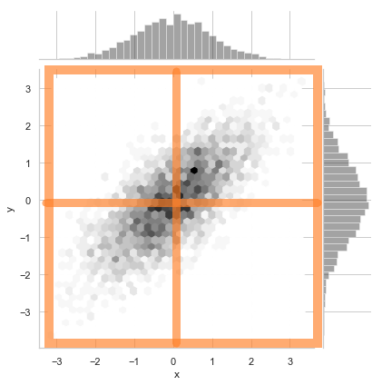
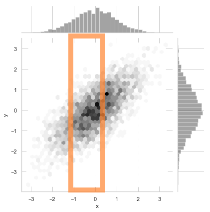

# Exploring the Non-Additivity of Correlation


In this notebook, I'll be exploring the non-additive properties of correlation, and the consequences that arise from this. This notebook is mostly inspired by Professor N.Taleb's [paper](https://www.dropbox.com/s/18pjy7gmz0hl6q7/Correlation.pdf?dl=0).


```python
import numpy as np
import pandas as pd
import matplotlib.pyplot as plt

import seaborn as sns
#sns.set(style = 'ticks')

import warnings
warnings.filterwarnings('ignore')


# import sklearn
```

## 1. Generating the data

First, we'll generate a bi-variate Gaussian distribution with the following properties:
- Mean of X = 0
- Mean of Y = 0

- Variance of X = 1
- Variance of Y = 1

- Covariance between X and Y = 0.8
- Correlation between X and Y = 0.8 (since both X and Y have variances of 1)


```python
mean = (0,0) # means
cov = [[1,0.7],[0.7,1]] # covariance matrix

X = np.random.multivariate_normal(mean, cov, 3000)
X_df = pd.DataFrame(X, columns = ['x','y'])
```


```python
with sns.axes_style("whitegrid"):
    sns.jointplot(x ='x', y='y', data=X_df, kind='hex', color='k')
```


## 2. Correlation of the Entire Dataset


```python
print(np.corrcoef(X_df['x'], X_df['y'])[0,1])
```

    0.7087620474806655
    

- Using numpy's `corrcoef` function returns a correlation coefficient of ~ **0.7**

   (which we specified in the covariance matrix when generating the numbers.)

## 3. Correlation of a Quadrant

Now, lets take a look at the correlation that you get if you ONLY looked at data from specific quadrants of the data (pictured below).
For example, we will first look at the **lower left quadrant**. 


```python
from IPython.display import Image
Image("C:/Users/Prabesh K/Desktop/project_images/corr_quadrants.png")
```





```python
lower_left_quadrant = X_df.loc[(X_df['x'] < 0) & (X_df['y'] < 0)]
print("Lower left quadrant Corr: ", np.corrcoef(lower_left_quadrant['x'], lower_left_quadrant['y'])[0,1])
```

    ('Lower left quadrant Corr: ', 0.4785811137836503)
    

- Here, for the data in the **lower left quadrant**, we get a correlation coefficient of only ~ **0.48**.

- This is quite a bit lower than the **0.7** that the entire dataset has.

- Intuitively, this makes sense, as the data within the quadrant (shown in the orange box pictured above) seems much less ordered than the entire dataset.

Below, I've repeated the same process, but for the remaining 3 quadrants.


```python
upper_left_quadrant = X_df.loc[(X_df['x'] < 0) & (X_df['y'] > 0)]
print("Upper left quadrant Corr: ", np.corrcoef(upper_left_quadrant['x'], upper_left_quadrant['y'])[0,1])
```

    ('Upper left quadrant Corr: ', 0.15851498857126428)
    


```python
upper_right_quadrant = X_df.loc[(X_df['x'] > 0) & (X_df['y'] > 0)]
print("Upper right quadrant Corr: ", np.corrcoef(upper_right_quadrant['x'], upper_right_quadrant['y'])[0,1])
```

    ('Upper right quadrant Corr: ', 0.49985169720832984)
    


```python
lower_right_quadrant = X_df.loc[(X_df['x'] > 0) & (X_df['y'] < 0)]
print("Lower right quadrant Corr: ", np.corrcoef(lower_right_quadrant['x'], lower_right_quadrant['y'])[0,1])
```

    ('Lower right quadrant Corr: ', 0.1500302606537467)
    

### Here is a quick summary of our results...

Quadrant Location| Number| Corr. Coefficient within quadrant
----|----|----
Upper right|1|**0.50**
Upper left|2|**0.16**
Lower left|3|**0.48**
Lower right|4|**0.15**

Summary so far: If you take a non-random block/chunk of data (e.g. a quadrant)from the whole population, the correlation of that sample will be lower. Below, I repeat similar steps, but for 'bands' of data.


## 4. Correlation for a band of data


```python
Image("C:/Users/Prabesh K/Desktop/project_images/corr_band.png")
```





```python
for i in range(-30, 30):
    band_start = i/10.0
    band_end = band_start + 1
    print("X-coords of band start and end at: ", band_start, band_end)
    band_of_data = X_df.loc[(X_df['x'] > band_start) & (X_df['x'] < band_end)]
    print("Corr within band: ", np.corrcoef(band_of_data['x'], band_of_data['y'])[0,1])
    print("")
```

    ('X-coords of band start and end at: ', -3.0, -2.0)
    ('Corr within band: ', 0.22762512204932595)
    
    ('X-coords of band start and end at: ', -2.9, -1.9)
    ('Corr within band: ', 0.2962417227848778)
    
    ('X-coords of band start and end at: ', -2.8, -1.7999999999999998)
    ('Corr within band: ', 0.32684222011919184)
    
    ('X-coords of band start and end at: ', -2.7, -1.7000000000000002)
    ('Corr within band: ', 0.22197085435398176)
    
    ('X-coords of band start and end at: ', -2.6, -1.6)
    ('Corr within band: ', 0.26271828904490674)
    
    ('X-coords of band start and end at: ', -2.5, -1.5)
    ('Corr within band: ', 0.17938678467178004)
    
    ('X-coords of band start and end at: ', -2.4, -1.4)
    ('Corr within band: ', 0.22714595565756615)
    
    ('X-coords of band start and end at: ', -2.3, -1.2999999999999998)
    ('Corr within band: ', 0.2009087082020317)
    
    ('X-coords of band start and end at: ', -2.2, -1.2000000000000002)
    ('Corr within band: ', 0.2718733758313571)
    
    ('X-coords of band start and end at: ', -2.1, -1.1)
    ('Corr within band: ', 0.286417605740843)
    
    ('X-coords of band start and end at: ', -2.0, -1.0)
    ('Corr within band: ', 0.2641146993398514)
    
    ('X-coords of band start and end at: ', -1.9, -0.8999999999999999)
    ('Corr within band: ', 0.3097493895969901)
    
    ('X-coords of band start and end at: ', -1.8, -0.8)
    ('Corr within band: ', 0.35283127619669624)
    
    ('X-coords of band start and end at: ', -1.7, -0.7)
    ('Corr within band: ', 0.31638058447533257)
    
    ('X-coords of band start and end at: ', -1.6, -0.6000000000000001)
    ('Corr within band: ', 0.2965266559490648)
    
    ('X-coords of band start and end at: ', -1.5, -0.5)
    ('Corr within band: ', 0.24310474333075874)
    
    ('X-coords of band start and end at: ', -1.4, -0.3999999999999999)
    ('Corr within band: ', 0.25548025786680034)
    
    ('X-coords of band start and end at: ', -1.3, -0.30000000000000004)
    ('Corr within band: ', 0.21045021048357132)
    
    ('X-coords of band start and end at: ', -1.2, -0.19999999999999996)
    ('Corr within band: ', 0.21802802777688793)
    
    ('X-coords of band start and end at: ', -1.1, -0.10000000000000009)
    ('Corr within band: ', 0.2344571508634391)
    
    ('X-coords of band start and end at: ', -1.0, 0.0)
    ('Corr within band: ', 0.21020362137484114)
    
    ('X-coords of band start and end at: ', -0.9, 0.09999999999999998)
    ('Corr within band: ', 0.23669931632081156)
    
    ('X-coords of band start and end at: ', -0.8, 0.19999999999999996)
    ('Corr within band: ', 0.27365493900052684)
    
    ('X-coords of band start and end at: ', -0.7, 0.30000000000000004)
    ('Corr within band: ', 0.2852542185865328)
    
    ('X-coords of band start and end at: ', -0.6, 0.4)
    ('Corr within band: ', 0.28376007836819284)
    
    ('X-coords of band start and end at: ', -0.5, 0.5)
    ('Corr within band: ', 0.28798708751363833)
    
    ('X-coords of band start and end at: ', -0.4, 0.6)
    ('Corr within band: ', 0.29468694534571144)
    
    ('X-coords of band start and end at: ', -0.3, 0.7)
    ('Corr within band: ', 0.3034769722753175)
    
    ('X-coords of band start and end at: ', -0.2, 0.8)
    ('Corr within band: ', 0.2947299269162213)
    
    ('X-coords of band start and end at: ', -0.1, 0.9)
    ('Corr within band: ', 0.2938355438666104)
    
    ('X-coords of band start and end at: ', 0.0, 1.0)
    ('Corr within band: ', 0.26162034748768587)
    
    ('X-coords of band start and end at: ', 0.1, 1.1)
    ('Corr within band: ', 0.2539135272876965)
    
    ('X-coords of band start and end at: ', 0.2, 1.2)
    ('Corr within band: ', 0.2468931375650243)
    
    ('X-coords of band start and end at: ', 0.3, 1.3)
    ('Corr within band: ', 0.24053387221485711)
    
    ('X-coords of band start and end at: ', 0.4, 1.4)
    ('Corr within band: ', 0.25707323385337916)
    
    ('X-coords of band start and end at: ', 0.5, 1.5)
    ('Corr within band: ', 0.2761563845065889)
    
    ('X-coords of band start and end at: ', 0.6, 1.6)
    ('Corr within band: ', 0.2721431973388881)
    
    ('X-coords of band start and end at: ', 0.7, 1.7)
    ('Corr within band: ', 0.2890160193478815)
    
    ('X-coords of band start and end at: ', 0.8, 1.8)
    ('Corr within band: ', 0.27285346941605626)
    
    ('X-coords of band start and end at: ', 0.9, 1.9)
    ('Corr within band: ', 0.2858136374896882)
    
    ('X-coords of band start and end at: ', 1.0, 2.0)
    ('Corr within band: ', 0.30242649483230394)
    
    ('X-coords of band start and end at: ', 1.1, 2.1)
    ('Corr within band: ', 0.2836990346348534)
    
    ('X-coords of band start and end at: ', 1.2, 2.2)
    ('Corr within band: ', 0.27204771655286)
    
    ('X-coords of band start and end at: ', 1.3, 2.3)
    ('Corr within band: ', 0.2427799888849455)
    
    ('X-coords of band start and end at: ', 1.4, 2.4)
    ('Corr within band: ', 0.3020488656715398)
    
    ('X-coords of band start and end at: ', 1.5, 2.5)
    ('Corr within band: ', 0.307662236599842)
    
    ('X-coords of band start and end at: ', 1.6, 2.6)
    ('Corr within band: ', 0.3273381068721675)
    
    ('X-coords of band start and end at: ', 1.7, 2.7)
    ('Corr within band: ', 0.34207858778440503)
    
    ('X-coords of band start and end at: ', 1.8, 2.8)
    ('Corr within band: ', 0.3010261428033253)
    
    ('X-coords of band start and end at: ', 1.9, 2.9)
    ('Corr within band: ', 0.3449842460605862)
    
    ('X-coords of band start and end at: ', 2.0, 3.0)
    ('Corr within band: ', 0.3571755826328277)
    
    ('X-coords of band start and end at: ', 2.1, 3.1)
    ('Corr within band: ', 0.38814401168969853)
    
    ('X-coords of band start and end at: ', 2.2, 3.2)
    ('Corr within band: ', 0.24571730237132286)
    
    ('X-coords of band start and end at: ', 2.3, 3.3)
    ('Corr within band: ', 0.30701486509423953)
    
    ('X-coords of band start and end at: ', 2.4, 3.4)
    ('Corr within band: ', 0.43434281194445257)
    
    ('X-coords of band start and end at: ', 2.5, 3.5)
    ('Corr within band: ', 0.4297648222390347)
    
    ('X-coords of band start and end at: ', 2.6, 3.6)
    ('Corr within band: ', 0.47242484728731793)
    
    ('X-coords of band start and end at: ', 2.7, 3.7)
    ('Corr within band: ', 0.3713056718537559)
    
    ('X-coords of band start and end at: ', 2.8, 3.8)
    ('Corr within band: ', 0.5242257951319034)
    
    ('X-coords of band start and end at: ', 2.9, 3.9)
    ('Corr within band: ', 0.5479210509289453)
    
    

### As you can see above, just like with the quadrants, the correlation is much lower within a broken-off chunk of the data.

We are getting correlations as low as ~ **0.20** within speific bands of data, but the correlation found with the entire dataset should be **0.7**. 


## 5. Final Thoughts

So it seems that if you take a small 'chunk' of data from the whole population (e.g. a quadrant, or a band), you can vastly under-estimate the (**Pearson**) correlation coefficient of the whole population.

I guess the lesson learnt from this is: do not use the Pearson correlation coefficient for a chunk of data, unless you've collected data for the entire range of the variables.

Possible areas where underestimating correlation could have a negative impact:
 - Risk management within finance (e.g. sector-asset correlation)
 - Medical statistics + Pharmaceutical studies (e.g. p-hacking to underplay the negative effects of a drug)


```python

```
